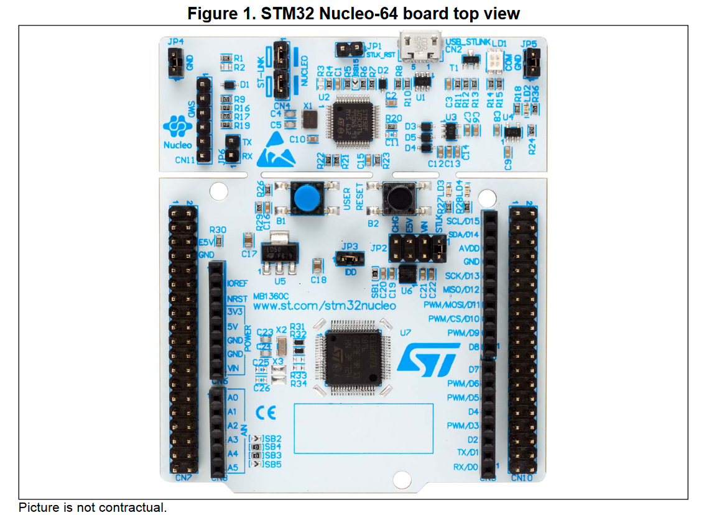
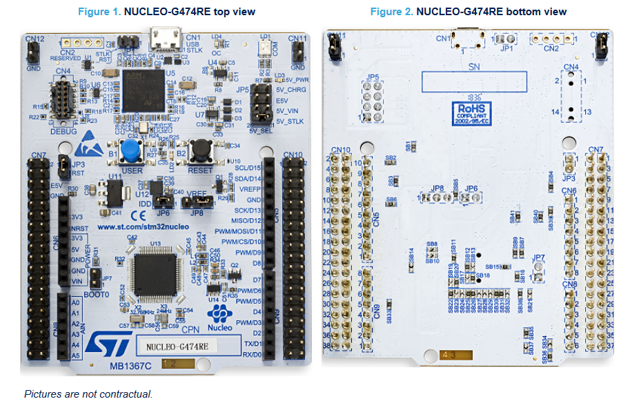

# LCD HD44780 lib - simple cross-platform C library
- [LCD HD44780 lib - simple cross-platform C library](#lcd-hd44780-lib---simple-cross-platform-c-library)
  - [Features](#features)
  - [Hardware configuration](#hardware-configuration)
    - [1. Requirements](#1-requirements)
    - [2. Schematic for possible hardware configurations when using 5V pin tolerant microcontroller](#2-schematic-for-possible-hardware-configurations-when-using-5v-pin-tolerant-microcontroller)
  - [LCD\_HD44780 library src folders file structure and description](#lcd_hd44780-library-src-folders-file-structure-and-description)
      - [1. lcd\_hd44780\_config.h](#1-lcd_hd44780_configh)
      - [2. lcd\_hd44780\_def\_char.h](#2-lcd_hd44780_def_charh)
      - [3. lcd\_hd44780\_interface.h](#3-lcd_hd44780_interfaceh)
      - [4. lcd\_hd44780.c](#4-lcd_hd44780c)
      - [5. lcd\_hd44780.h](#5-lcd_hd44780h)
  - [Examples](#examples)
    - [1. STM32G071RB -bare metal implementation](#1-stm32g071rb--bare-metal-implementation)
      - [Requirements for compiling and running the example:](#requirements-for-compiling-and-running-the-example)
      - [Hardware requirements, configuration, and connections](#hardware-requirements-configuration-and-connections)
      - [LCD\_HD44780 library configuration - lcd\_hd44780\_config.h](#lcd_hd44780-library-configuration---lcd_hd44780_configh)
      - [How to build and run the example](#how-to-build-and-run-the-example)
    - [2. STM32G474 - STMCubeIDE project generated with LL drivers](#2-stm32g474---stmcubeide-project-generated-with-ll-drivers)
      - [Requirements for compiling and running the example](#requirements-for-compiling-and-running-the-example-1)
      - [Hardware configuration and connections](#hardware-configuration-and-connections)
      - [LCD\_HD44780 library configuration - lcd\_hd44780\_config.h](#lcd_hd44780-library-configuration---lcd_hd44780_configh-1)
      - [How to build and run the example](#how-to-build-and-run-the-example-1)
    - [3. AVR ATmega 328P](#3-avr-atmega-328p)
      - [Requirements for compiling and running the example](#requirements-for-compiling-and-running-the-example-2)
      - [Hardware configuration and connections](#hardware-configuration-and-connections-1)
      - [LCD\_HD44780 library configuration - lcd\_hd44780\_config.h](#lcd_hd44780-library-configuration---lcd_hd44780_configh-2)
      - [How to build and run the example](#how-to-build-and-run-the-example-2)
    - [4. ESP8266 NONOS SDK](#4-esp8266-nonos-sdk)
      - [Requirements](#requirements)
      - [Hardware connections](#hardware-connections)
      - [LCD\_HD44780 library configuration - lcd\_hd44780\_config.h](#lcd_hd44780-library-configuration---lcd_hd44780_configh-3)
      - [How to build and run the example](#how-to-build-and-run-the-example-3)
        - [Windows](#windows)
        - [Linux - tbd](#linux---tbd)
  - [How to use in your Project - simple case without user-predefined characters](#how-to-use-in-your-project---simple-case-without-user-predefined-characters)
  - [How to use in your Project- simple case with user-predefined characters](#how-to-use-in-your-project--simple-case-with-user-predefined-characters)
  - [How to define custom characters and custom character banks.](#how-to-define-custom-characters-and-custom-character-banks)
    - [Example of Correspondence between EPROM Address Data and Character Pattern (5 × 8 Dots)](#example-of-correspondence-between-eprom-address-data-and-character-pattern-5--8-dots)
    - [Defining special characters in code.](#defining-special-characters-in-code)
    - [Defining banks for special characters.](#defining-banks-for-special-characters)
  - [Project main folders file structure](#project-main-folders-file-structure)

## Features
- Works with LCD connected in 4-bit mode, 
- One-direction or bi-direction communication with LCD (predefined time slots or LCD RW pin usage)
- Easy to port on different microcontrollers
- Contain examples of porting to STM32, AVR, ESP8266
- Allows to display strings/chars directly on LCD
- Allows to put strings/chars in buffer and refresh LCD periodically with buffer content
- Allows to define custom chars (more than 8) as well as custom char banks where different combinations of custom characters can be easily loaded to LCD CGRAM
- Contain functions for displaying on LCD int values as a string representing:
  - int format 
  - hex format 
  - bin format
- The library has currently predefined following LCD types:
  - 2 lines 16 characters (1602)
  - 4 lines 16 characters (1604)
  - 4 lines 20 characters (2004)
- Allows to configure and compile only functionality that will be needed in the project
- Allows to control LCD backlight
## Hardware configuration
### 1. Requirements
- LCD should be connected to uC in 4bit mode 
- LCD RW Pin can be connected to uC or GND -> user must define specific options in library configuration.
- LCD data pins D4-D7 and LCD signal pins can be connected to any pins on any ports on uC side.
### 2. Schematic for possible hardware configurations when using 5V pin tolerant microcontroller
- Using RW pin of the LCD  (set **USE_RW_PIN &nbsp; ON** in lcd_hd44780_config.h)<br><br>
<br> <br><br>
- Without using RW pin of the LCD  (set **USE_RW_PIN &nbsp; OFF** in lcd_hd44780_config.h)
<br><br>
<br> <br><b>
ATTENTION!<br> 
When using controller that do not tolerant 5V on their pins, appropriate voltage levels converter should be used for signals: LCD_DB4, LCD_DB5, LCD_DB6, LCD_DB7, LCD_RS, LCD_E,  LCD_RW </b>
## LCD_HD44780 library src folders file structure and description
```bash 
LCD_HD44780
├───src
│   ├───lcd_hd44780_config.h
│   ├───lcd_hd44780_def_char.h
│   ├───lcd_hd44780_interface.h
│   ├───lcd_hd44780.c
│   ├───lcd_hd44780.h
...
```
#### 1. lcd_hd44780_config.h
  Header file for configuration of the library. In this file, it's required to configure:
  - LCD type 
  - Usage of RW Signal/PIN
  - Usage of LCD buffer for displaying the content on the LCD
  - Backlight enable pin active state
  - Which functions from LCD_HD44780 lib you would like to compile and use in your project (by default all functions are added to compilation).
#### 2. lcd_hd44780_def_char.h
Header file for defining user special characters and user special characters banks. Each bank can contain up to 8 characters that are user-defined combinations of characters from defined user-special characters. This allows to creation of different combinations of special characters that can be loaded depending on current code needs.
#### 3. lcd_hd44780_interface.h
Header file with library interface declaration that needs to be implemented on the drivers' side. Please look at the code examples in the "examples/lcd_driver_intrface_example_implementations" for more details.
#### 4. lcd_hd44780.c
Library main C file 
#### 5. lcd_hd44780.h
Library main header file with available library functions.
## Examples
### 1. STM32G071RB -bare metal implementation
#### Requirements for compiling and running the example:
  1. CMake installed
  2. Make or Ninja installed
  3. ARM GNU Toolchain (gcc-arm-none-eabi) installed
  4. STM32_Programmer_CLI installed
  5. ST-link (placed on Nucleo Board) installed
#### Hardware requirements, configuration, and connections
  1. STM32G071 Nucleo-64<br>
     <br> <br> 
  2. LCD Keypad Shield for Arduino<br>
   <br> <br> 
  3. Pin connection between LCD Keypad Shield and Nucleo board<br>
   <br> <br>
#### LCD_HD44780 library configuration - lcd_hd44780_config.h
  ```C
    /************************************  LCD HARDWARE SETTINGS *******************************
     *   LCD_TYPE -> Set one of the predefined types:
     *               2004 -> 4 lines 20 characters per line
     *               1604 -> 4 lines 16 characters per line
     *               1602 -> 2 lines 16 characters per line
     *   USE_RW_PIN -> Defines HW connection between LCD and uC
     *               ON - when the RW pin is connected
     *               OFF - when the RW pin is not connected
     *  LCD_BCKL_PIN_EN_STATE -> Defines Active state of the LCD backlight enable pin
     *               HIGH - when pin active state is high
     *               LOW - when pin active state is low
     *  LCD_BUFFERING -> Define whether buffering functionalities of the LCD should be added to compilation
     *               ON - add buffering functionality to the compilation
     *               OFF - remove buffering functionality form the compilation
     ********************************************************************************************/
    #define LCD_TYPE        1602
    #define USE_RW_PIN      OFF 

    #define LCD_BCKL_PIN_EN_STATE HIGH

    #define LCD_BUFFERING  ON
  ```

  ```C
    /********************************  LCD LIBRARY COMPILATION SETTINGS ************************
     *      Setting USE_(procedure name) to:
     *          ON  - add specific procedure to compilation
     *          OFF - exclude specific procedure from compilation
    ********************************************************************************************/
    #define USE_DEF_CHAR_FUNCTION           ON
    #define USE_LCD_INT                     ON
    #define USE_LCD_HEX                     ON
    #define USE_LCD_BIN                     ON

    #define USE_LCD_CURSOR_HOME             ON
    #define USE_LCD_CURSOR_ON               ON
    #define USE_LCD_CURSOR_OFF              ON
    #define USE_LCD_BLINKING_CURSOR_ON      ON

    #if LCD_BUFFERING == ON
    #define USE_LCD_BUF_INT                 ON
    #define USE_LCD_BUF_HEX                 ON
    #define USE_LCD_BUF_BIN                 ON
    #endif
  ```
#### How to build and run the example
  1. Open the location you want to clone the repository to in your terminal
  2. Clone the repository to your preferred localization
      ```bash
      git clone https://github.com/niwciu/LCD_HD44780.git
      ``` 
  3. Enter to  LCD_HD44780/examples/STM32G071RB_NUCLEO_BARE_METAL
      ```bash
      cd ./LCD_HD44780/examples/STM32G071RB_NUCLEO_BARE_METAL
      ``` 
  4. For Make type:
      ```bash
      cmake -S ./ -B Debug -G"Unix Makefiles" -DCMAKE_BUILD_TYPE=Debug
      ```
      ```bash
      cd Debug
      ```
      ```bash 
      make all
      ```
      ```bash 
      make flash
      ``` 
  5. For Ninja type:
      ```bash 
      cmake -S ./ -B Debug -G"Ninja" -DCMAKE_BUILD_TYPE=Debug
      ```
      ```bash
      cd Debug
      ```
      ```bash
      ninja
      ```
      ```bash 
      ninja flash
      ```
   6. In some cases Nucleo board requires plugging out and in a USB port to run the program.

### 2. STM32G474 - STMCubeIDE project generated with LL drivers
#### Requirements for compiling and running the example
  1. CMake installed
  2. Make or Ninja installed
  3. ARM GNU Toolchain (gcc-arm-none-eabi) installed
  4. STM32_Programmer_CLI installed
  5. ST-link (placed on Nucleo Board) installed
#### Hardware configuration and connections
  1. STM32G474 Nucleo-64<br>
     <br> <br> 
  2. LCD Keypad Shield for Arduino<br>
   <br> <br> 
  3. Pin connection between LCD Keypad Shield and Nucleo board <br>
   <br> <br>
#### LCD_HD44780 library configuration - lcd_hd44780_config.h
  ```C
    /************************************  LCD HARDWARE SETTINGS *******************************
     *   LCD_TYPE -> Set one of the predefined types:
     *               2004 -> 4 lines 20 characters per line
     *               1604 -> 4 lines 16 characters per line
     *               1602 -> 2 lines 16 characters per line
     *   USE_RW_PIN -> Defines HW connection between LCD and uC
     *               ON - when the RW pin is connected
     *               OFF - when the RW pin is not connected
     *  LCD_BCKL_PIN_EN_STATE -> Defines Active state of the LCD backlight enable pin
     *               HIGH - when pin active state is high
     *               LOW - when pin active state is low
     *  LCD_BUFFERING -> Define whether buffering functionalities of the LCD should be added to compilation
     *               ON - add buffering functionality to the compilation
     *               OFF - remove buffering functionality form the compilation
     ********************************************************************************************/
    #define LCD_TYPE        1602
    #define USE_RW_PIN      OFF 

    #define LCD_BCKL_PIN_EN_STATE HIGH

    #define LCD_BUFFERING  ON
  ```

  ```C
    /********************************  LCD LIBRARY COMPILATION SETTINGS ************************
     *      Setting USE_(procedure name) to:
     *          ON  - add specific procedure to compilation
     *          OFF - exclude specific procedure from compilation
    ********************************************************************************************/
    #define USE_DEF_CHAR_FUNCTION           ON
    #define USE_LCD_INT                     ON
    #define USE_LCD_HEX                     ON
    #define USE_LCD_BIN                     ON

    #define USE_LCD_CURSOR_HOME             ON
    #define USE_LCD_CURSOR_ON               ON
    #define USE_LCD_CURSOR_OFF              ON
    #define USE_LCD_BLINKING_CURSOR_ON      ON

    #if LCD_BUFFERING == ON
    #define USE_LCD_BUF_INT                 ON
    #define USE_LCD_BUF_HEX                 ON
    #define USE_LCD_BUF_BIN                 ON
    #endif
  ```
#### How to build and run the example
  1. Open the location you want to clone the repository to in your terminal
  2. Clone the repository to your preferred localization
      ```bash
      git clone https://github.com/niwciu/LCD_HD44780.git
      ``` 
  3. Enter to  LCD_HD44780/examples/STM32G474RE_NUCLEO_CUBE_IDE_LL/
      ```bash
      cd ./LCD_HD44780/examples/STM32G474RE_NUCLEO_CUBE_IDE_LL
      ``` 
  4. For Make type:
      ```bash
      cmake -S ./ -B Debug -G"Unix Makefiles" -DCMAKE_BUILD_TYPE=Debug
      ```
      ```bash
      cd Debug
      ```
      ```bash 
      make all
      ```
      ```bash 
      make flash
      ``` 
  5. For Ninja type:
      ```bash 
      cmake -S ./ -B Debug -G"Ninja" -DCMAKE_BUILD_TYPE=Debug
      ```
      ```bash
      cd Debug
      ```
      ```bash
      ninja
      ```
      ```bash 
      ninja flash
      ```

### 3. AVR ATmega 328P
#### Requirements for compiling and running the example
  1. CMake installed
  2. Make or Ninja installed
  3. AVR 8-bit GNU Toolchain 
  4. AVRdude Installed
  5. USBasp programmer installed and updated
#### Hardware configuration and connections
  1. Arduino UNO R3<br>
     <br> <br> 
  2. USBasp programmer<br>
   <br> <br>
  3. LCD Keypad Shield for Arduino<br>
   <br> <br> 
  4. Pin connection between LCD Keypad Shield and Nucleo board<br>
   <br> <br>
#### LCD_HD44780 library configuration - lcd_hd44780_config.h
  ```C
    /************************************  LCD HARDWARE SETTINGS *******************************
     *   LCD_TYPE -> Set one of the predefined types:
     *               2004 -> 4 lines 20 characters per line
     *               1604 -> 4 lines 16 characters per line
     *               1602 -> 2 lines 16 characters per line
     *   USE_RW_PIN -> Defines HW connection between LCD and uC
     *               ON - when the RW pin is connected
     *               OFF - when the RW pin is not connected
     ********************************************************************************************/
    #define LCD_TYPE        1602
    #define USE_RW_PIN      OFF 

    #define LCD_BCKL_PIN_EN_STATE HIGH

    #define LCD_BUFFERING  ON
  ```

  ```C
    /********************************  LCD LIBRARY COMPILATION SETTINGS ************************
     *      Setting USE_(procedure name) to:
     *          ON  - add specific procedure to compilation
     *          OFF - exclude specific procedure from compilation
    ********************************************************************************************/
    #define USE_DEF_CHAR_FUNCTION           ON
    #define USE_LCD_INT                     ON
    #define USE_LCD_HEX                     ON
    #define USE_LCD_BIN                     ON

    #define USE_LCD_CURSOR_HOME             ON
    #define USE_LCD_CURSOR_ON               ON
    #define USE_LCD_CURSOR_OFF              ON
    #define USE_LCD_BLINKING_CURSOR_ON      ON

    #if LCD_BUFFERING == ON
    #define USE_LCD_BUF_INT                 ON
    #define USE_LCD_BUF_HEX                 ON
    #define USE_LCD_BUF_BIN                 ON
    #endif
  ```
#### How to build and run the example
  1. Open the location you want to clone the repository to in your terminal
  2. Clone the repository to your preferred localization
      ```bash
      git clone https://github.com/niwciu/LCD_HD44780.git
      ``` 
  3. Enter to LCD_HD44780/examples/ATMEGA328P_ARDUINO_UNO_R3 folder
      ```bash
      cd ./LCD_HD44780/examples/ATMEGA328P_ARDUINO_UNO_R3
      ``` 
  4. For Make type:
      ```bash
      cmake -S ./ -B Build -G"Unix Makefiles"
      ``` 
      ```bash
      cd Build
      ``` 
      ```bash
      make all
      ``` 
      ```bash
      make write_fuses
      ``` 
      ```bash
      make flash
      ``` 
  5. For Ninja type:
      ```bash 
      cmake -S ./ -B Build -G"Ninja"
      ```
      ```bash
      cd Build
      ```
      ```bash
      ninja
      ```
      ```bash 
      ninja write_fuses
      ```
      ```bash 
      ninja flash
      ```

### 4. ESP8266 NONOS SDK
#### Requirements
  1. Make installed
  2. ESP Toolchain installed according to esspresif doc
     - For Windows:<br>
        https://docs.espressif.com/projects/esp8266-rtos-sdk/en/latest/get-started/windows-setup.html
     -  For Linux: <br>
        https://docs.espressif.com/projects/esp8266-rtos-sdk/en/latest/get-started/linux-setup.html
  3. Downloaded Flash Download Tool V3.8.5
  4. ESP8266 NodeMCU V3 installed
#### Hardware connections
  1. ESP8266 NodeMCU V3<br>
     <br> <br> 
  2. LCD Keypad Shield for Arduino<br>
   <br> <br> 
  3. Pin connection between LCD Keypad Shield and ESP8266 NoneMCU board<br>
   <br> <br>
#### LCD_HD44780 library configuration - lcd_hd44780_config.h
  ```C
    /************************************  LCD HARDWARE SETTINGS *******************************
     *   LCD_TYPE -> Set one of the predefined types:
     *               2004 -> 4 lines 20 characters per line
     *               1604 -> 4 lines 16 characters per line
     *               1602 -> 2 lines 16 characters per line
     *   USE_RW_PIN -> Defines HW connection between LCD and uC
     *               ON - when the RW pin is connected
     *               OFF - when the RW pin is not connected
     ********************************************************************************************/
    #define LCD_TYPE        1602
    #define USE_RW_PIN      OFF 

    #define LCD_BCKL_PIN_EN_STATE HIGH

    #define LCD_BUFFERING  ON
  ```

  ```C
    /********************************  LCD LIBRARY COMPILATION SETTINGS ************************
     *      Setting USE_(procedure name) to:
     *          ON  - add specific procedure to compilation
     *          OFF - exclude specific procedure from compilation
    ********************************************************************************************/
    #define USE_DEF_CHAR_FUNCTION           ON
    #define USE_LCD_INT                     ON
    #define USE_LCD_HEX                     ON
    #define USE_LCD_BIN                     ON

    #define USE_LCD_CURSOR_HOME             ON
    #define USE_LCD_CURSOR_ON               ON
    #define USE_LCD_CURSOR_OFF              ON
    #define USE_LCD_BLINKING_CURSOR_ON      ON

    #if LCD_BUFFERING == ON
    #define USE_LCD_BUF_INT                 ON
    #define USE_LCD_BUF_HEX                 ON
    #define USE_LCD_BUF_BIN                 ON
    #endif
  ```
#### How to build and run the example 
##### Windows
  1. Open the location you want to clone the repository to in your terminal
  2. Clone the repository to your preferred location
      ```bash
      git clone https://github.com/niwciu/LCD_HD44780.git
      ``` 
  3. Enter to LCD_HD44780/examples/ESP8266_NONOS_SDK/LCD_HD44780_TEST folder
      ```bash
      cd ./LCD_HD44780/examples/ESP8266_NONOS_SDK/LCD_HD44780_TEST
      ``` 
  4. Clean the project by running clean.bat script
      ```bash
      ./clean.bat
      ``` 
  5. Build the project by running build.bat script
      ```bash
      ./build.bat
      ``` 
  6. Run flash_download_tool_3.8.5
  7. Select "Developer Mode" and "ESP8266 DownloadTool"
  8. Set all fields as it is shown on picture bellow<br>
     <br> <br> 
  9. Select COM port on which your NodeMCU board has been installed
  10. Click START to flash the IC
  11. After flash is done pres reset button on your NodeMCU board
##### Linux - tbd
## How to use in your Project - simple case without user-predefined characters
1. Copy LCD library src files (or files from src folder) to your project and add copied files in your project configuration, so they can be included in your project. 
2. In lcd_hd44780.config.h 
   - Define specyfic **LCD_TYPE** <br>
    &emsp; &emsp;LCD_TYPE -> set one of the predefined types:<br>
                &emsp; &emsp;&emsp; &emsp;2004 -> 4 lines 20 characters per line<br>
                &emsp; &emsp;&emsp; &emsp;1604 -> 4 lines 16 characters per line<br>
                &emsp; &emsp;&emsp; &emsp;1602 -> 2 lines 16 characters per line<br>
    - Define usage of **RW Pin**<br>
    &emsp; &emsp;USE_RW_PIN -> Defines HW connection between LCD and uC<br>
                &emsp; &emsp;&emsp; &emsp;ON - when RW pin is connected<br>
                &emsp; &emsp;&emsp; &emsp;OFF - when RW pin is not connected<br>
    - Define HW setup for **LCD_BCKL_PIN** <br>
    &emsp; &emsp;LCD_BCKL_PIN_EN_STATE -> Defines active state for enabling LCD backlight<br>
                &emsp; &emsp;&emsp; &emsp;HIGH - when high state on output pin is required to enable LCD backlight<br>
                &emsp; &emsp;&emsp; &emsp;LOW - when low state on output pin is required to enable LCD backlight<br>
    - Define usage of LCD buffering functionality **LCD_BUFFERING** <br>
    &emsp; &emsp;LCD_BUFFERING -> Defines whether you would ike to use LCD buffer or write directly to LCD screen<br>
                &emsp; &emsp;&emsp; &emsp;ON - when buffering of LCD is planned to be use in project<br>
                &emsp; &emsp;&emsp; &emsp;OFF - when buffering of LCD is NOT planned to be use in project<br>


3. Declare the LCD IO driver interface in your application on the GPIO driver side. This interface should contain the following implementation defined in lcd_hd44780_interface.h
```C 
   /************LCD_IO_driver_interface implementation START**************/
static const struct LCD_IO_driver_interface_struct LCD_IO_driver = {
    init_LCD_data_and_SIG_pins,
    set_LCD_DATA_PINS_as_outputs,
    set_LCD_DATA_PINS_as_inputs,
    set_LCD_DATA_PINS_state,
    get_LCD_DATA_PINS_state,
    LCD_set_SIG,
    LCD_reset_SIG,
    _delay_us,
};
const struct LCD_IO_driver_interface_struct *LCD_IO_driver_interface_get(void)
{
    return &LCD_IO_driver;
}

```
It's a basic interface that connects the library with your HW driver layer in the application without making any dependencies between them. <br>In **.examples/lcd_driver_intrface_example_implementations** folder you can find a template with empty definitions of all required interface elements as well as a few files with examples of implementations for different microcontrollers. Additional details of the implementation in the project can be also found in ready to compile examples.


## How to use in your Project- simple case with user-predefined characters
1. Copy LCD library src files (or files from src folder) to your project and add copied files in your project configuration, so they can be included in your project.
2. In lcd_hd44780.config.h 
   - Define specyfic **LCD_TYPE** <br>
    &emsp; &emsp;LCD_TYPE -> set one of the predefined types:<br>
                &emsp; &emsp;&emsp; &emsp;2004 -> 4 lines 20 characters per line<br>
                &emsp; &emsp;&emsp; &emsp;1604 -> 4 lines 16 characters per line<br>
                &emsp; &emsp;&emsp; &emsp;1602 -> 2 lines 16 characters per line<br>
    - Define usage of **RW Pin**<br>
    &emsp; &emsp;USE_RW_PIN -> Defines HW connection between LCD and uC<br>
                &emsp; &emsp;&emsp; &emsp;ON - when RW pin is connected<br>
                &emsp; &emsp;&emsp; &emsp;OFF - when RW pin is not connected<br>
    - Define HW setup for **LCD_BCKL_PIN** <br>
    &emsp; &emsp;LCD_BCKL_PIN_EN_STATE -> Defines active state for enabling LCD backlight<br>
                &emsp; &emsp;&emsp; &emsp;HIGH - when high state on output pin is required to enable LCD backlight<br>
                &emsp; &emsp;&emsp; &emsp;LOW - when low state on output pin is required to enable LCD backlight<br>
    - Define usage of LCD buffering functionality **LCD_BUFFERING** <br>
    &emsp; &emsp;LCD_BUFFERING -> Defines whether you would ike to use LCD buffer or write directly to LCD screen<br>
                &emsp; &emsp;&emsp; &emsp;ON - when buffering of LCD is planned to be use in project<br>
                &emsp; &emsp;&emsp; &emsp;OFF - when buffering of LCD is NOT planned to be use in project<br>

3. Specify which procedures from to library you would like to compile and use in your project.<br>
      To do this, Edit defines in section: <br>
    ```C
    /********************************  LCD LIBRARY COMPILATION SETTINGS ************************
    *      Setting USE_(procedure name) to:
    *          ON  - add specific procedure to compilation
    *          OFF - exclude specific procedure from compilation
    ********************************************************************************************/
    #define USE_DEF_CHAR_FUNCTION           ON
    #define USE_LCD_INT                     ON
    #define USE_LCD_HEX                     ON
    #define USE_LCD_BIN                     ON

    #define USE_LCD_CURSOR_HOME             ON
    #define USE_LCD_CURSOR_ON               ON
    #define USE_LCD_CURSOR_OFF              ON
    #define USE_LCD_BLINKING_CURSOR_ON      ON

    #if LCD_BUFFERING == ON
    #define USE_LCD_BUF_INT                 ON
    #define USE_LCD_BUF_HEX                 ON
    #define USE_LCD_BUF_BIN                 ON
    #endif
    ```
    <br>
4. If setting USE_DEF_CHAR_FUNCTION &nbsp; ON define special characters and character banks in lcd_hd44780_def_char.h <br> For more details about defining custom char please refer to [How to define custom characters and custom character banks.](#how-to-define-custome-charatcters-and-custom-character-banks)
5. Declare the LCD IO driver interface in your application on the GPIO driver side. This interface should contain the following implementation defined in lcd_hd44780_interface.h<br>
   <br>
    ```C 
   /************LCD_IO_driver_interface implementation START**************/
    static const struct LCD_IO_driver_interface_struct LCD_IO_driver = {
        init_LCD_data_and_SIG_pins,
        set_LCD_DATA_PINS_as_outputs,
        set_LCD_DATA_PINS_as_inputs,
        set_LCD_DATA_PINS_state,
        get_LCD_DATA_PINS_state,
        LCD_set_SIG,
        LCD_reset_SIG,
        _delay_us,
    };
    const struct LCD_IO_driver_interface_struct *LCD_IO_driver_interface_get(void)
    {
        return &LCD_IO_driver;
    }
    ```
    <br>
    It's a basic interface that connects the library with your HW driver layer in the application without making any dependencies between them. <br>In **.examples/lcd_driver_intrface_example_implementations** folder you can find a template with empty definitions of all required interface elements as well as a few files with examples of implementation for different microcontrollers.  Additional details of the implementation in the project can be also found in ready to compile examples.
## How to define custom characters and custom character banks.
### Example of Correspondence between EPROM Address Data and Character Pattern (5 × 8 Dots)
<br>
<br>
### Defining special characters in code.
If the letter shown in the picture above should be defined as a special character its definition should look like this:
```C
static const uint8_t leter_b[8] = {16, 16, 22, 25, 17, 17, 30, 0};
```
### Defining banks for special characters.
HD44780 allows the user to define a maximum of 8 user characters. Therefore on character bank can contain only up to 8 characters. Nevertheless, it's possible to define a couple of special character banks with different combinations of special characters. Depending on needs one of the banks can be loaded to the CGRAM and switched to another if the information presented on the LCD requires different special characters

Below you can find a simple example of two special characters bank definitions:
1.  Definition of special characters in lcd_hd44780_def_char.h:
    ```C
    static const uint8_t Pol_e[8] = {0, 0, 14, 17, 31, 16, 14, 3};
    static const uint8_t Pol_o[8] = {2, 4, 14, 17, 17, 17, 14, 0};
    static const uint8_t Pol_s[8] = {2, 4, 14, 16, 14, 1, 30, 0};
    static const uint8_t Pol_l[8] = {12, 4, 6, 12, 4, 4, 14, 0};
    static const uint8_t Pol_c[8] = {2, 4, 14, 16, 16, 17, 14, 0};
    static const uint8_t Pol_a[8] = {0, 0, 14, 1, 15, 17, 15, 3};
    static const uint8_t Pol_n[8] = {2, 4, 22, 25, 17, 17, 17, 0};
    static const uint8_t Zn_wody[8] = {0, 0, 0, 6, 9, 2, 4, 15};
    static const uint8_t Pol_z1[8] = {4, 32, 31, 2, 4, 8, 31, 0};
    static const uint8_t Pol_z2[8] = {2, 4, 31, 2, 4, 8, 31, 0};
    ```
2. Declaration of lcd_cgram_bank_1 in lcd_hd44780_def_char.h:
    ```C
    static const struct char_bank_struct lcd_cgram_bank_1 = 
    {
      Pol_e,
      Pol_o,
      Pol_s,
      Pol_l,
      Pol_c,
      Pol_a,
      Pol_n,
      Zn_wody
    };
    enum LCD_CGRAM_BANK_1
    {
      pol_e,
      pol_o,
      pol_s,
      pol_l,
      pol_c,
      pol_a,
      pol_n,
      zn_wody,
    };
    ```
3. Declaration of lcd_cgram_bank_2 in lcd_hd44780_def_char.h:
    ```C
    static const struct char_bank_struct lcd_cgram_bank_1 = 
    {
      Pol_e,
      Pol_o,
      Pol_s,
      Pol_l,
      Pol_c,
      Pol_a,
      Pol_z1,
      Pol_z2
    };
    enum LCD_CGRAM_BANK_1
    {
      pol_e,
      pol_o,
      pol_s,
      pol_l,
      pol_c,
      pol_a,
      pol_z1,
      pol_z2,
    };
    ```
4. When special characters from bank_1 are needed to display content on an LCD screen, it's required to call in the code:
    ```C
    lcd_load_char_bank(&lcd_cgram_bank_1);
    ```
5. When special characters from bank_2 are required to display content on an LCD screen, then it's required to call in code:
    ```C
    lcd_load_char_bank(&lcd_cgram_bank_2);
    ```


## Project main folders file structure
```bash 
LCD_HD44780
├───.github
├───doc
├───examples
│   ├───ATMEGA328P_ARDUINO_UNO_R3
│   ├───config
│   ├───doc
│   ├───ESP8266_NONOS_SDK
│   ├───lcd_driver_intrface_example_implementations
│   └───STM32G071RB_NUCLEO_BARE_METAL
│   └───STM32G474RE_NUCLEO_CUBE_IDE_LL
├───reports
│   ├───Code_Coverage
│   └───Cyclomatic_Complexity
├───src
└───test
    ├───hw_test
    │   ├───ATMEGA328P_ARDUINO_UNO_R3
    │   └───STM32F030R8_CUBE_IDE
    ├───lcd_hd44780
    ├───template                
    └───unity
```
Folder description:
- .github -> Folder with githubactions .yml scripts
- doc -> folder for any documentation needed or created in the project
- examples -> folder with example hardware implementations contain ready to compile examples for different uC and templates of lcd_driver_interface implementations.
  - ATMEGA328P_ARDUINO_UNO_R3 -> example project
  - config ->  tollchain files
  - doc -> files used for examples documentation
  - ESP8266_NONOS_SDK -> example project
  - lcd_driver_intrface_example_implementations -> as named
  - STM32G071RB_NUCLEO_BARE_METAL -> example project
  - STM32G474RE_NUCLEO_CUBE_IDE_LL -> example project
- src -> library source files
- test -> folder where all tests are written. The folder contains following subfolders:
  - hw_test -> folder with configurations/setups for specific ucontrollers to make integration tests
  - lcd_hd44780 -> folder where all unit tests for lcd_hd44780 module are kept
  - template -> empty setup for uint test (copy, paste, rename, edit for new module unit testing) 
  - unity -> unity framework

